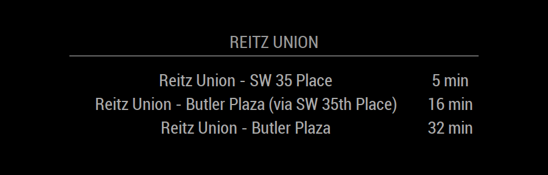

# MMM-Transloc
`MMM-Transloc` was created to use with the same API that Rider App uses and commonly used around many college campus bus systems.



## Dependencies / Requirements

> npm install unirest

You will also need to create a API key at [RapidAPI](https://rapidapi.com/transloc/api/openapi-1-2)

to find your particular Agency Number type with your API key placed in
````bash
curl --get --include 'https://transloc-api-1-2.p.rapidapi.com/agencies.json?'   -H 'X-RapidAPI-Host: transloc-api-1-2.p.rapidapi.com'   -H 'X-RapidAPI-Key: YOUR KEY' >> AllAgencies.txt
````
will place every agency in a text file for you to search

to find your bus stop either use your specific [Transloc Site](https://ufl.transloc.com/m/stop/code/473) or
````bash
curl --get --include 'https://transloc-api-1-2.p.rapidapi.com/stops.json?callback=call&agencies= YOUR AGENCY NUMBER'   -H 'X-RapidAPI-Host: transloc-api-1-2.p.rapidapi.com'   -H 'X-RapidAPI-Key: YOUR KEY'
````
that will display all stops for your agency

## Configuration

To use this module, add it to the modules array in the `config/config.js` file:
````javascript
modules: [
{
	header: 'Reitz Union',
    module: 'MMM-Transloc',
    position: 'lower_third',
    config: {
    	url:'testMe', // Optional
    	arrayName: 'arrivals',// Required
    	updateInterval: 1000,
    	stop_id: 4093250,
    	AgencyNum: 116,
    	Key: ""
        
             }
}

]
````

## Example

